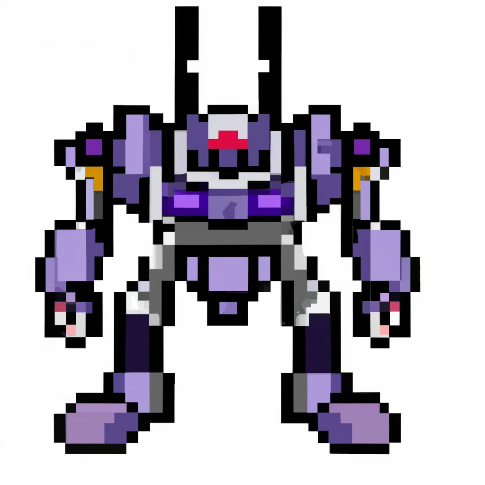

## Vehicle for Sale by Owner
By Ben Rosen | benrosen.itch.io

A solo roleplaying game about selling your mech.

You are a mech pilot. The time has come to sell your old ride.

Use this guide to help you write a “classifieds ad” that showcases your mech to potential buyers.

### BEFORE YOU PLAY, YOU NEED:

- [x] This rule sheet
- [ ] 1 six-sided die (D6)
- [ ] 1 pack of standard playing cards
- [ ] Pen and paper

### BEFORE YOUR FIRST TURN:
1. Shuffle the deck
2. Roll the D6 and draw that many cards (you can put the rest of the cards off to the side; you won’t need them)

### EACH TURN:
1. Play a card from your hand
2. Use the [SYSTEMS](#systems) table and the [ASPECTS](#aspects) table to derive a prompt (e.g. the prompt for the five of hearts would be “weapons anecdote”. Three of diamonds would be “AI quirk”. The ace of spades would be “power specifications”.)
3. Roll the D6 and use the [APPEAL](#appeal) table to determine how appealing buyers will find this aspect of your mech's system.
4. Write a sentence or two (or three…) about this aspect of your mech's system, keeping in mind its appeal to your potential buyers.

### AFTER PLAYING ALL YOUR CARDS:
1. Double-check your ad for spelling and grammatical errors
2. Choose a fair listing price for your mech
3. Post your ad somewhere potential buyers are likely to see it

### ASPECTS
<table>
  <tr>
    <th>Suit</th>
    <th>Aspect</th>
    <th>Description</th>
  </tr>
  <tr>
    <td>♦</td>
    <td>Quirk</td>
    <td>These are unique characteristics or idiosyncrasies of your mech that make it stand out from others. It could be an unusual feature, behavior, or attribute of the mech that might appeal to potential buyers.</td>
  </tr>
  <tr>
    <td>♣</td>
    <td>Appearance</td>
    <td>This refers to the physical look of your mech. It could include things like color, size, or any additional aesthetic modifications you've made. The right appearance might be crucial for buyers looking for a specific aesthetic.</td>
  </tr>
  <tr>
    <td>♥</td>
    <td>Anecdote</td>
    <td>Anecdotes are personal stories or experiences associated with your mech. They can add a personal touch or historical context to your mech, which can increase its appeal to certain buyers.</td>
  </tr>
  <tr>
    <td>♠</td>
    <td>Specification</td>
    <td>These are detailed descriptions of your mech's technical aspects, such as its power output, weapon capabilities, or sensor range. Clear and accurate specifications can assure buyers of what they're getting.</td>
  </tr>
  </tr>
</table>

### SYSTEMS
<table>
  <tr>
    <th>Rank</th>
    <th>System</th>
    <th>Description</th>
  </tr>
  <tr>
    <td>A</td>
    <td>Power</td>
    <td>This system provides the energy required to power the mech's various functions, including movement, weapon usage, and system operations.</td>
  </tr>
  <tr>
    <td>2</td>
    <td>Interface</td>
    <td>This is the user-friendly control panel or control system that allows the pilot to operate the mech effectively.</td>
  </tr>
  <tr>
    <td>3</td>
    <td>AI</td>
    <td>This system assists the pilot by controlling certain functions autonomously, providing important feedback, and offering tactical advice.</td>
  </tr>
  <tr>
    <td>4</td>
    <td>Sensors</td>
    <td>These systems allow the mech to perceive the world around it, identifying potential threats or objectives in the environment.</td>
  </tr>
    <tr>
    <td>5</td>
    <td>Weapons</td>
    <td>This includes any offensive capabilities the mech possesses, from projectile weapons to energy beams or even melee weapons.</td>
  </tr>
  <tr>
    <td>6</td>
    <td>Armor</td>
    <td>This is the defensive shell of the mech, designed to withstand attacks and protect the pilot and internal systems from damage.</td>
  </tr>
  <tr>
    <td>7</td>
    <td>Cargo</td>
    <td>This refers to the storage capacity of the mech, for carrying anything from supplies and ammunition to secondary equipment or mission-specific items.</td>
  </tr>
  <tr>
    <td>8</td>
    <td>Chassis</td>
    <td>The structural framework of the mech, providing support and integrity for the various systems and components.</td>
  </tr>
    <tr>
    <td>9</td>
    <td>Aesthetics</td>
    <td>This refers to the visual design and appearance of the mech, which can be designed for practical purposes like camouflage, or for symbolic and cultural significance.</td>
  </tr>
  <tr>
    <td>10</td>
    <td>Communications</td>
    <td>These are the systems the mech uses to send and receive information, whether communicating with a base of operations, other mechs, or other entities.</td>
  </tr>
  <tr>
    <td>J</td>
    <td>Safety</td>
    <td>This system encompasses all features designed to protect the pilot and ensure the safe operation of the mech, such as safety protocols, emergency systems, and protective features.</td>
  </tr>
  <tr>
    <td>Q</td>
    <td>Repairability</td>
    <td>This refers to the ease and efficiency with which the mech can be repaired, either through automated systems, user-friendly design, or support from external sources.</td>
  </tr>
    <tr>
    <td>K</td>
    <td>Accessories</td>
    <td>These are additional features or equipment that support the core function of the mech, enhancing its capabilities or offering specialized functions for specific situations.</td>
  </tr>
</table>

### APPEAL

<table>
<tr>
    <td>1</td>
    <td>Dealbreaker</td>
  </tr>
  <tr>
    <td>2</td>
    <td>Problem</td>
  </tr>
  <tr>
    <td>3</td>
    <td>Defect</td>
  </tr>
  <tr>
    <td>4</td>
    <td>Feature</td>
  </tr>
    <tr>
    <td>5</td>
    <td>Bonus</td>
  </tr>
  <tr>
    <td>6</td>
    <td>Luxury</td>
  </tr>
</table>
